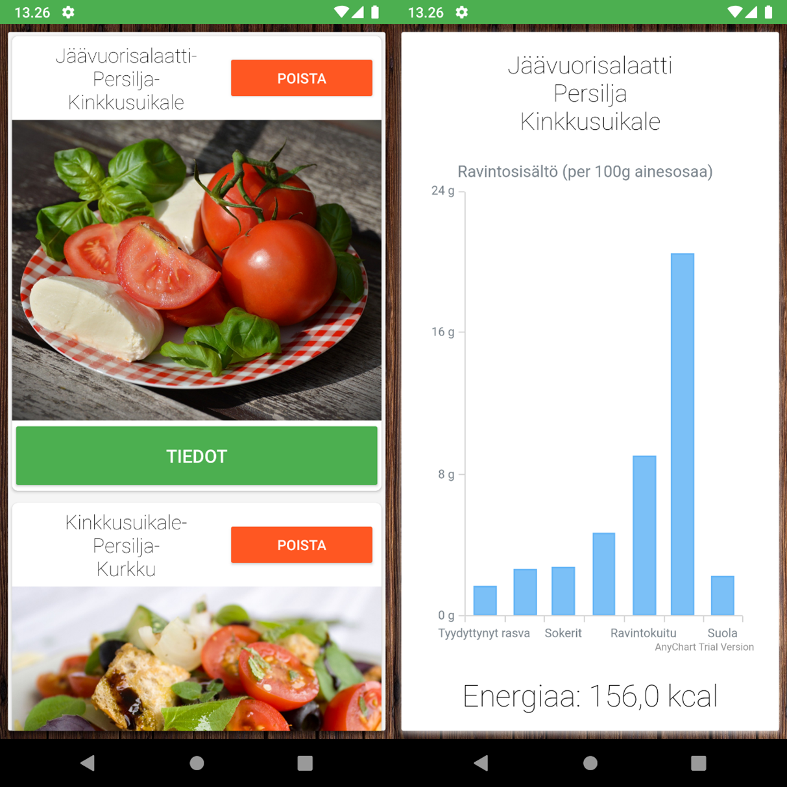

# SaladMixer

- SaladMixer is a basic Android application developed as part of a mobile development course. It creates randomized salads based on a set of saved ingredients.
- It displays nutrition data of a salad or and ingredient in a chart.
- Firebase is utilized for database functionality and login/authentication but it **does not work** out of the box, as no API-key/connection string is provided.

